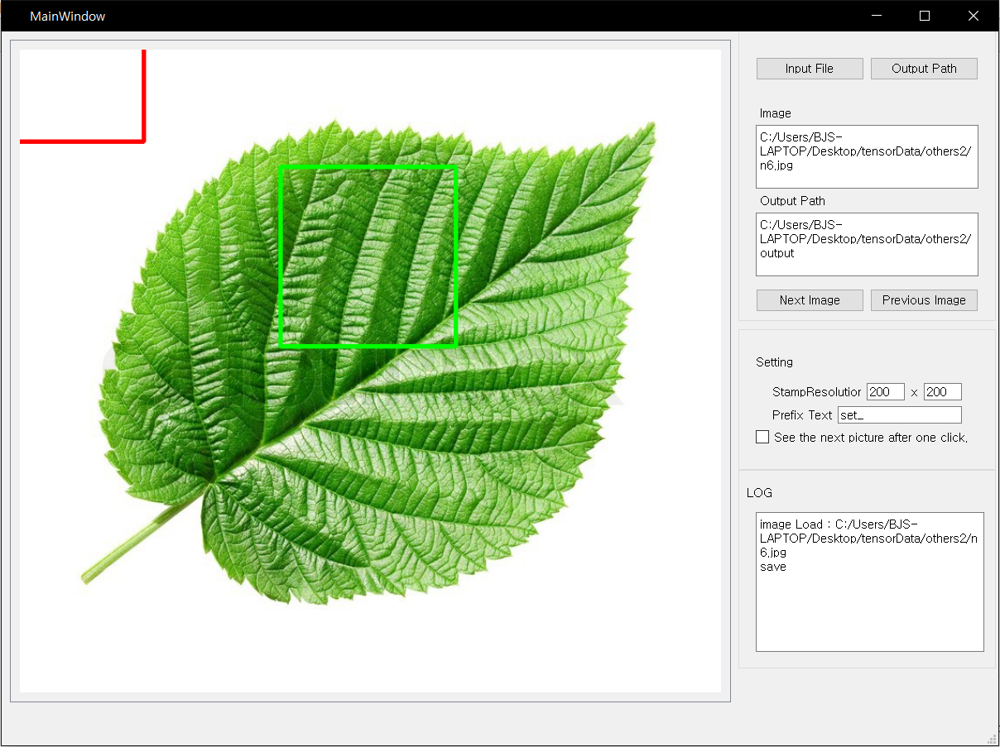

# StampCropTool

Convenient GUI application for quickly get dataset for deaplearning
or get crop image



### Dependencies and requirements

+ `python 3.6`
+ `pyqt 5.x`
+ `opencv 3.x`
+ `numpy 1.11.x`
+ `natsort=5.3.x`
+ `msgpack=0.5.x`

If using Anaconda, you can use the provided `environment.yml` file with `conda env create -f environment.yml`, which will create a virtual environment `sct-py36`.

### Usage

```bash
activate sct-py36
python StampCropTool.py
```


### License
This source was created by referring to the following link

Thank you for AngusG

https://github.com/AngusG/truth-and-crop
